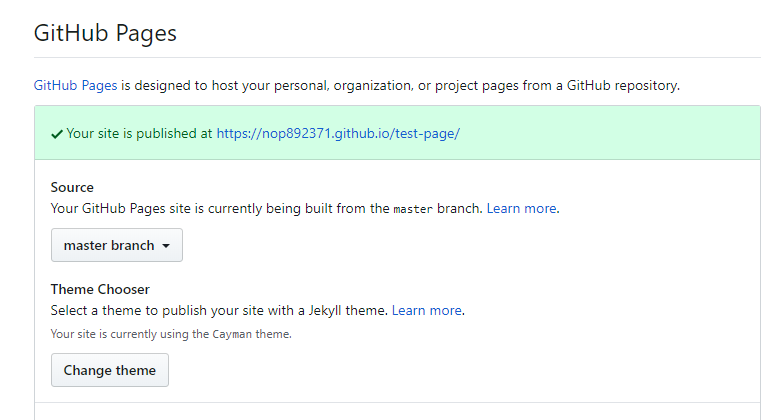

# Github Pages

# 導入手順

Github Pagesはgithub上にサイトを公開できる機能です。

1. githubにpublicなリポジトリを作成します。
    nop892371/test-page
2. `git clone`でローカルにコピーします。
3. 何かファイルを作成しpushします。
4. settingを開きます。
    1．GitHub PagesのセクションでSourceを設定します。
        