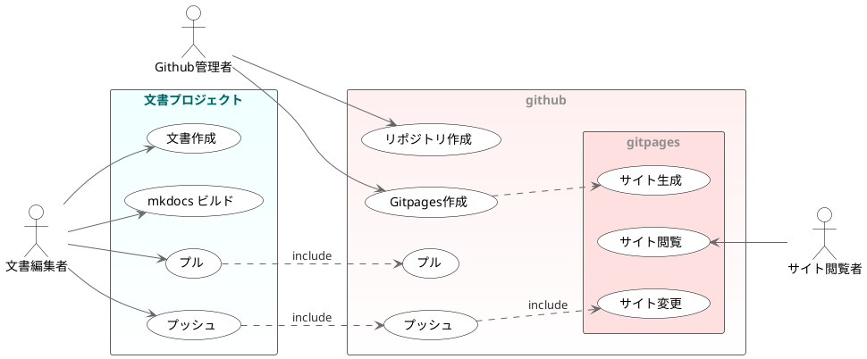
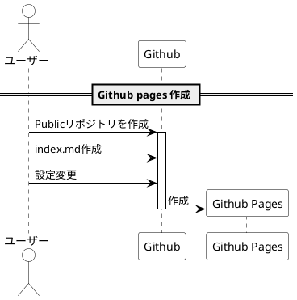

# PlantUmlについて

!!! summary ""
    UMLを描くツールです。テキストで記述します。


## ユースケース図

ユースケース図の例



??? note "code"
    ```text
    @startuml
    skinparam shadowing                false
    skinparam actorBorderColor         Black
    skinparam ActorBackgroundColor     white
    skinparam usecaseArrowColor        #666666
    skinparam usecaseArrowFontColor    #303030
    skinparam UsecaseBackgroundColor   white
    skinparam usecaseBorderColor       Black
    skinparam rectangleBorderColor     #606060
    skinparam rectangleFontColor       #909090
    skinparam rectangleBorderThickness 1
    skinparam DefaultFontName "Meiryo UI"

    left to right direction

    actor :Github管理者: as admin
    actor :文書編集者:   as user
    actor :サイト閲覧者: as viewer

    rectangle "<font color=#006666>文書プロジェクト" #f0ffff-ffffff {
        usecase (文書作成) as edit
        usecase (mkdocs ビルド) as build
        usecase (プル) as lpl
        usecase (プッシュ) as lpc
        user --> edit
        user --> build
        user --> lpc
        user --> lpl
    }
    rectangle github #fff0f0-ffffff {
        usecase (リポジトリ作成) as crr
        usecase (Gitpages作成) as mgp
        usecase (プッシュ) as hg
        usecase (プル) as spl
        admin --> crr
        admin --> mgp
        lpc ..> hg : include
        lpl ..> spl : include
        rectangle gitpages #ffe0e0 {
            mgp ..> (サイト生成)
            viewer --> (サイト閲覧)
            hg ..> (サイト変更) : include
        }
    }
    @enduml
    ```
## シーケンス図

シーケンス図の例



??? note "code"
    ```text
    @startuml
    skinparam shadowing false
    skinparam ActorBorderColor black
    skinparam ActorBackgroundColor white
    skinparam SequenceBoxBorderColor black
    skinparam ParticipantBorderColor black
    skinparam ParticipantBackgroundColor white
    skinparam SequenceLifeLineBorderColor black
    skinparam SequenceArrowColor black
    skinparam DefaultFontName "Meiryo UI"

    actor ユーザー as user
    participant Github as Github
    participant "Github Pages" as page

    == Github pages 作成 ==
    user -> Github ++ : Publicリポジトリを作成
    user -> Github : index.md作成
    user -> Github : 設定変更
    Github --> page ** : 作成
    deactivate
    @enduml
    ```

## ER図

[er.puml](er.puml) - ソースコード[^er_puml]

```plantuml
--8<-- "docs/plantuml/er.puml"
```

[^er_puml]:
    ```text
    --8<-- "docs/plantuml/er.puml"
    ```

## マインドマップ

サイトマップ整理

[sitemap.puml](sitemap.puml) - ソースコード[^sitemap_puml]

```plantuml
--8<-- "docs/plantuml/sitemap.puml"
```

[^sitemap_puml]:
    ```text
    --8<-- "docs/plantuml/sitemap.puml"
    ```